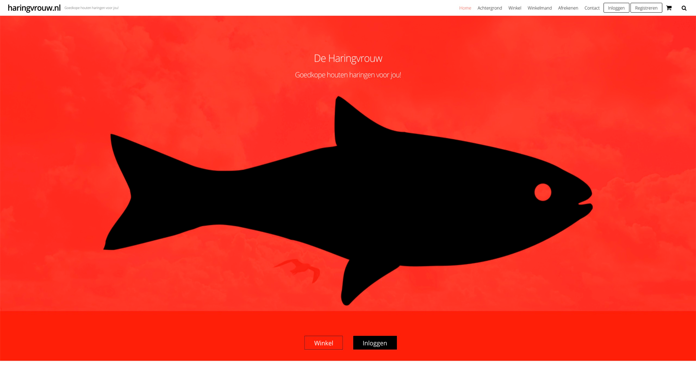
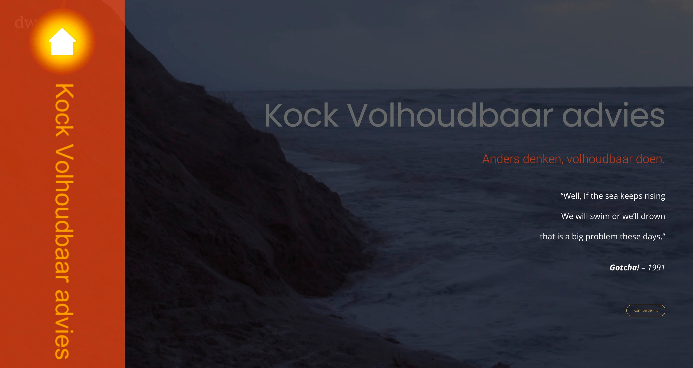
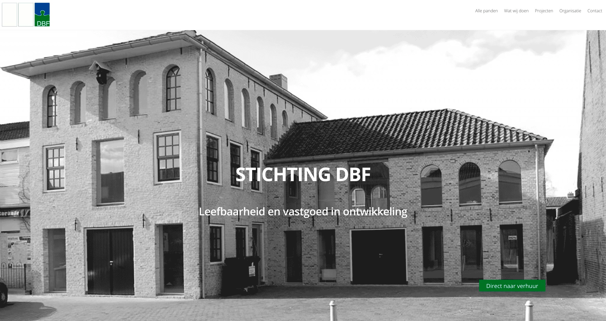
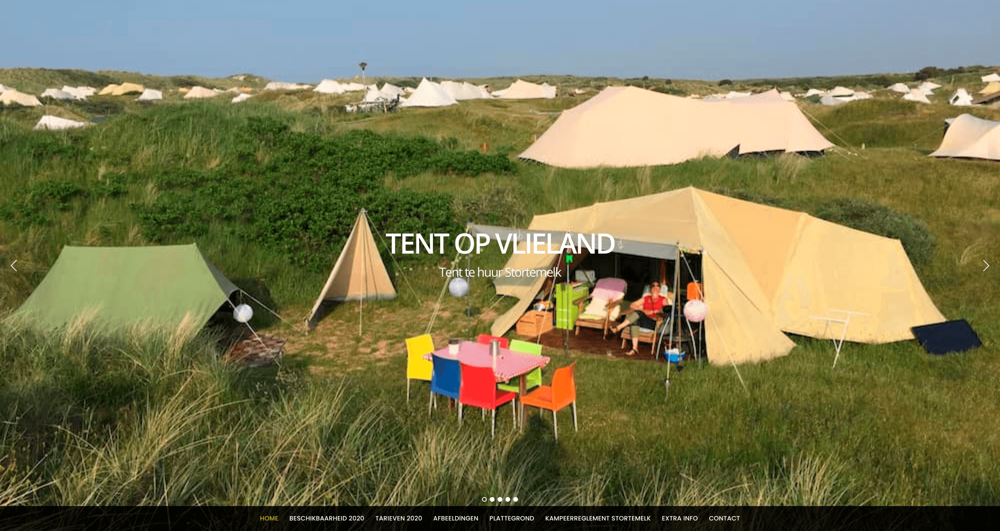

# jodelajo.nl

# 1. great css hamburger
##html:
```html
<div id="navbar">
        <label for="hamburger">&#9776;</label>
        <input type="checkbox" id="hamburger"/>
    <div id="menu">
            <a href="index.html" class="menuClass">Home</a>
            <a href="html/portfolio.html" class="menuClass">Portfolio</a>
            <a href="html/contact.html" class="menuClass">Contact</a>
        </div>
    </div>
```
## css mobile size:
```css
#navbar {
    display: flex;
    flex-direction: column;
    margin-right: 30px;
}

nav label {
    display: block;
    font-size: 2.4em;
    align-self: flex-end;
}

#hamburger, #menu {
    display: none;
}

#menu {
    align-self: flex-end;
    align-content: space-between;
}

.menuClass {
    display: block;
    text-decoration: none;
    padding-top: 8px;
    padding-bottom: 5px;
    text-align: end;
}

#menu a {
    color: #ffffff;
}

nav input:checked ~ #menu {
    display: block;

}
```
## css desktop size:
```css

@media screen and (min-width: 1400px) {
    nav label, #hamburger {
        display: none;
    }

    #menu {
        display: flex;
        justify-content: flex-end;
    }
    
    #menu a {
        box-sizing: border-box;
        display: block;
        width: 100%;
        padding-left: 40px;
        text-align: end;
        line-height: 2.8em;
        color: #ffffff;
        text-decoration: none;
    }

    #menu a:hover {
        color: #540225;
    }
    
    #menu a:active {
        color: rgba(247, 45, 129, 0.55);
    }
```
# 2. automatic slider javascript
## html:
```html
 <div id="block_image">
            
            
            
            
        </div>
```

## css:
```css
.mySlides {
    display: none;
}
```

## javascript:
```javascript
var slideIndex = 0;
carousel();

function carousel() {
    let i;
    var x = document.getElementsByClassName("mySlides");
    for (i = 0; i < x.length; i++) {
        x[i].style.display = "none";
    }
    slideIndex++;
    if (slideIndex > x.length) {
        slideIndex = 1}
    x[slideIndex-1].style.display = "block";
    setTimeout(carousel, 4000);
}
```
# 3. image gallery with filter function

Something did go wrong. Didn't display "show all" gallery at default. Had to force it with adding "show" in class in html.
## html:
```html
 <div id="port_container">
    <div class="content website show">
        <a href="portfolio/haringvrouw.html">
            
        </a>
    </div>
    <div class="content logo show">
        <a href="portfolio/kva2021.html">
            
        </a>
    </div>
    <div class="content website show">
        <a href="portfolio/dbf.html">
            
        </a>
    </div>
    <div class="content website show">
        <a href="portfolio/tentopvlie.html">
            
        </a>
    </div>
    <div class="content huisstijl show">
        <a href="portfolio/haringvrouw.html">
            
        </a>
    </div>
</div>
```
## css mobile:
```css
#myBtnContainer {
    width: 120px;
    height: 120px;
    background-color: #ffffff;
    border: 18px solid #000000;
    padding: 14px;
    display: flex;
}

.content {
    display: none;
    width: 100%;
}

.show {
    display: block;
}

#port_container {
    column-count: 1;
    overflow: hidden;
}

.mySlides_port{
    width: 100%;
    height: auto;
}

.btn {
    border: 8px solid #000000;
    margin: 0;
    width: 45%;
    height: 45%;
    background-color: #000000;
    color: #ffffff;
}

.btn a {
    font-family: montserrat, sans-serif;
    color: #ffffff;
}

.btn:hover {
    background-color: #ddd;
}

.btn.active {
    background-color: #ffffff;
    color: #540225;
}
```

## css desk-top: 
@media screen and (min-width: 1400px)
```css
@media screen and (min-width: 1400px) {

    #myBtnContainer {
        display: flex;
        flex-direction: column;
        justify-content: center;
        align-items: center;
        flex-wrap: nowrap;
        width: 50%;
        margin-left: 20px;
        margin-right: 20px;
        padding-top: 20px;
        padding-bottom: 20px;
        border: 12px solid #000000;
    }

    .btn {
        border: 4px solid #000000;
        padding: 2px;
        width: 80%;
        background-color: #000000;
        color: #ffffff;
    }
}
```
## javascript:
```javascript

filterSelection("all")
function filterSelection(c) {
    var x, i;
    x = document.getElementsByClassName("content");
    if (c == "all") c = "";
    for (i = 0; i < x.length; i++) {
        w3RemoveClass(x[i], "show");
        if (x[i].className.indexOf(c) > -1) w3AddClass(x[i], "show");
    }
}

function w3AddClass(element, name) {
    var i, arr1, arr2;
    arr1 = element.className.split(" ");
    arr2 = name.split(" ");
    for (i = 0; i < arr2.length; i++) {
        if (arr1.indexOf(arr2[i]) == -1) {element.className += " " + arr2[i];}
    }
}

function w3RemoveClass(element, name) {
    var i, arr1, arr2;
    arr1 = element.className.split(" ");
    arr2 = name.split(" ");
    for (i = 0; i < arr2.length; i++) {
        while (arr1.indexOf(arr2[i]) > -1) {
            arr1.splice(arr1.indexOf(arr2[i]), 1);
        }
    }
    element.className = arr1.join(" ");
}

// Add active class to the current button (highlight it)
var btnContainer = document.getElementById("myBtnContainer");
var btns = btnContainer.getElementsByClassName("btn");
for (var i = 0; i < btns.length; i++) {
    btns[i].addEventListener("click", function(){
        var current = document.getElementsByClassName("active");
        current[0].className = current[0].className.replace(" active", "");
        this.className += " active";
    });
}
```
